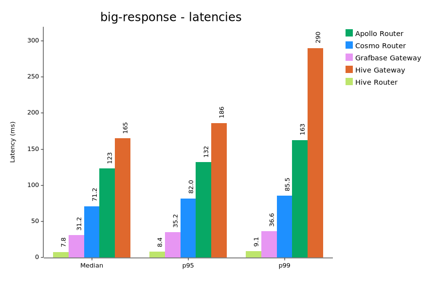
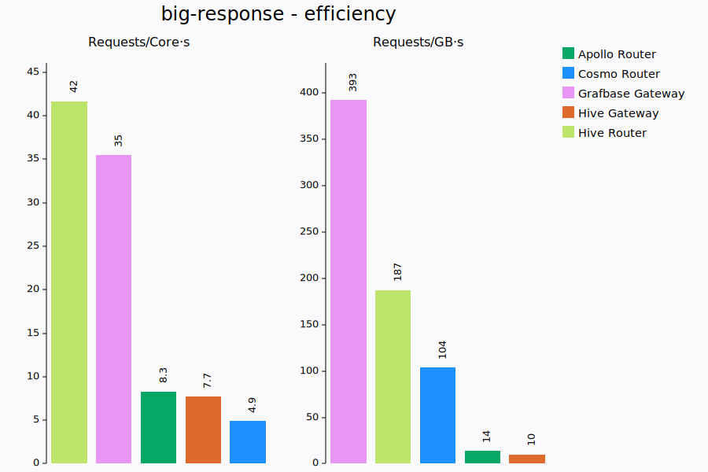
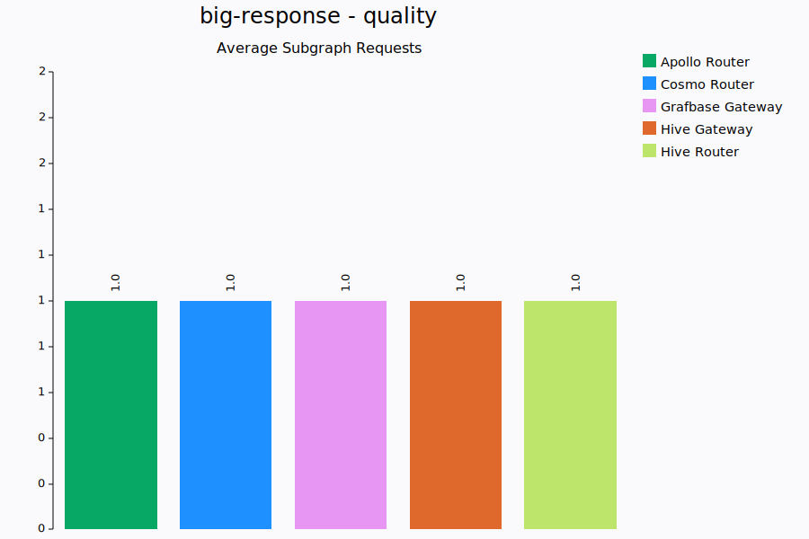
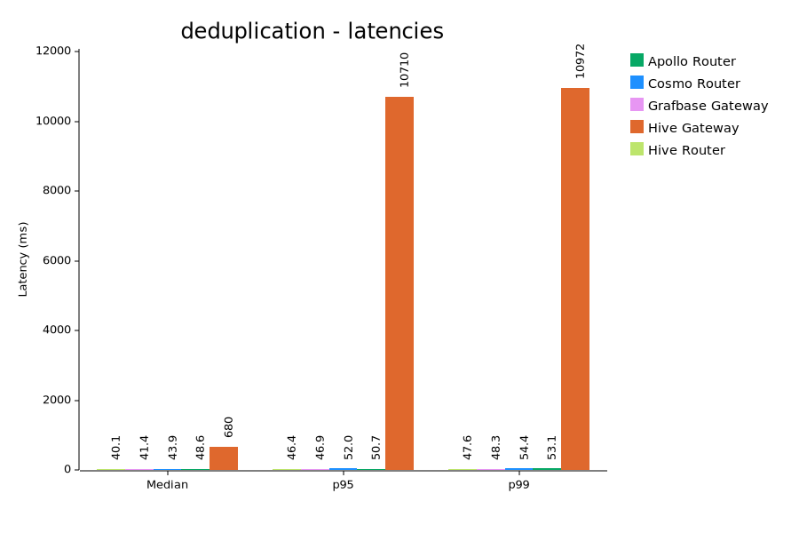
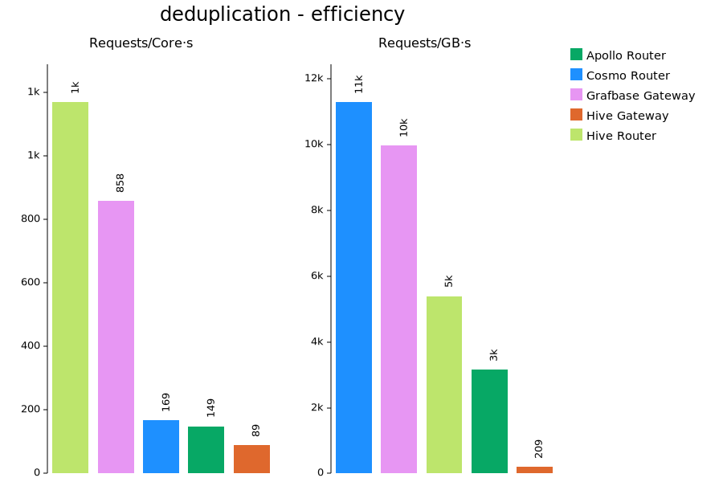
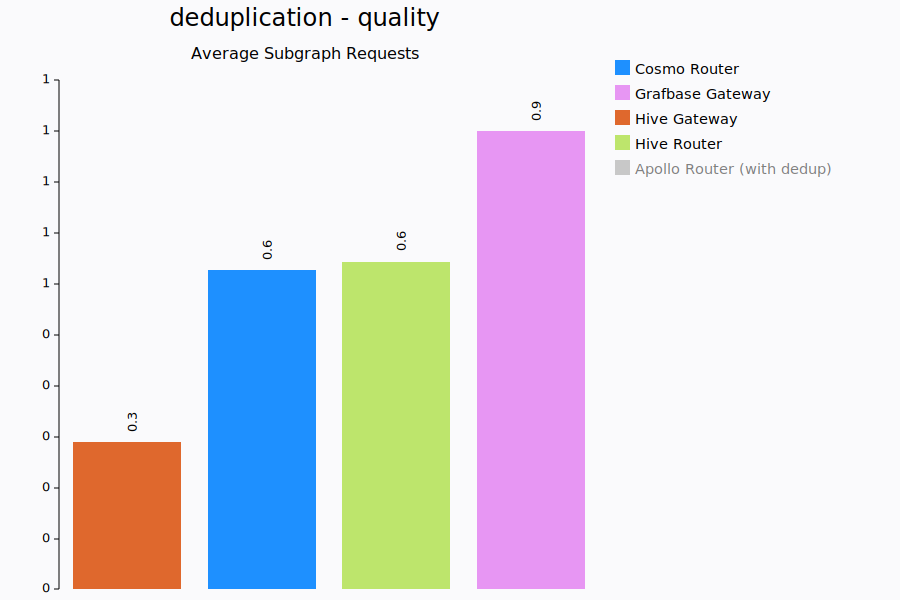
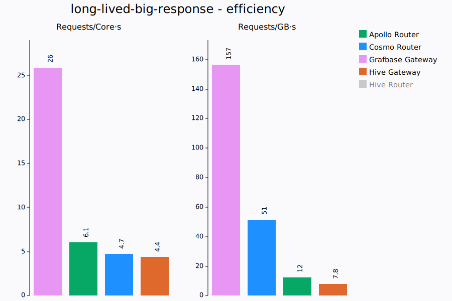
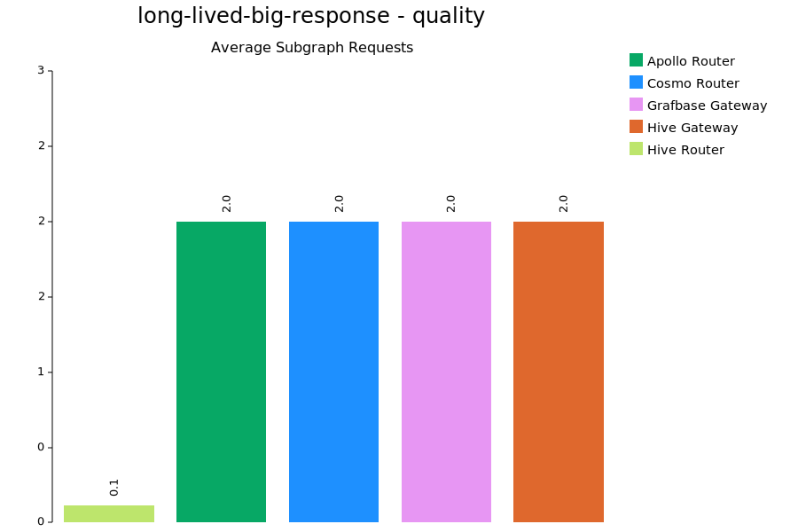
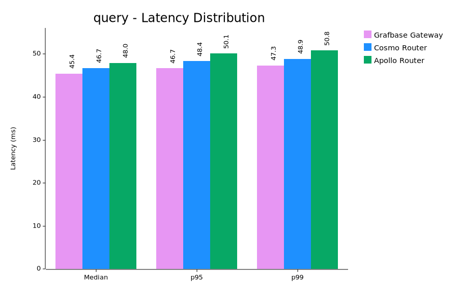
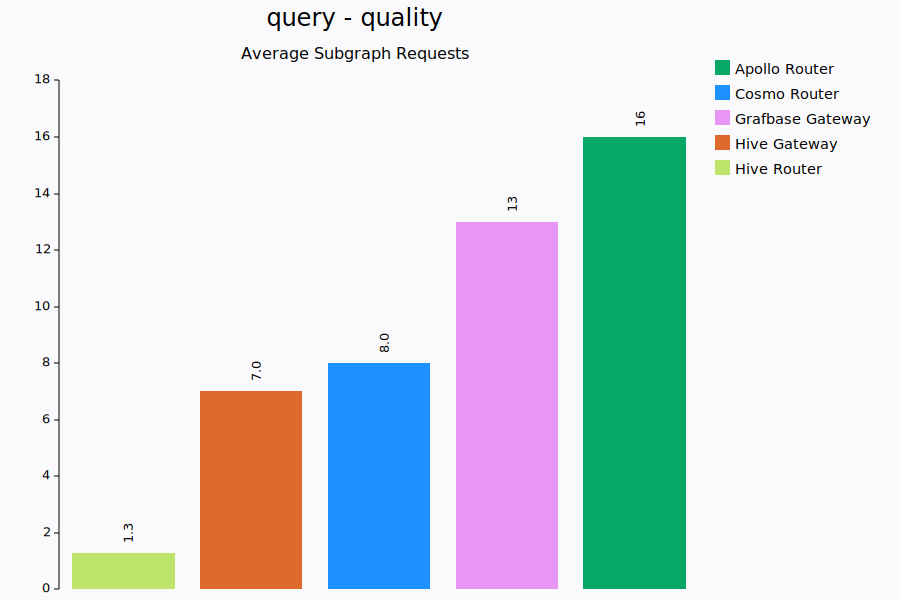

# System Information

- Date: 2025-09-05
- CPU: AMD Ryzen 9 7950X3D 16-Core Processor
- Memory: 93.4 GiB
- CPU Boost: Disabled
- Git Commit: a724dfc5587a4b930b047d51cd5a313e616e4388
- Linux Version: 6.16.1
- Docker Version: 28.3.3

# big-response

Tests gateway performance with large GraphQL response payloads (~8MiB) containing a mix of lists, objects strings, floats and ints.

K6 runs with a single VU, executing requests sequentially, to measure the best case latencies a gateway could provide.

## Latencies (ms)

| Gateway          |   Min |   Med |   P90 |   P95 |   P99 |   Max |
| :--------------- | ----: | ----: | ----: | ----: | ----: | ----: |
| Hive Router      |  21.6 |  25.5 |  28.4 |  29.6 |  32.3 | 131.9 |
| Grafbase Gateway |  24.8 |  29.9 |  32.8 |  33.9 |  36.2 | 134.2 |
| Cosmo Router     |  51.7 |  72.3 |  80.9 |  83.0 |  87.1 | 193.9 |
| Apollo Router    | 113.5 | 123.9 | 129.7 | 132.0 | 137.5 | 240.5 |
| Hive Gateway     | 155.4 | 161.6 | 174.2 | 176.9 | 190.8 | 374.3 |

## Resources

| Gateway          |       CPU | CPU max |      Memory | MEM max | requests/core.s | requests/GB.s |
| :--------------- | --------: | ------: | ----------: | ------: | --------------: | ------------: |
| Hive Router      |   79% ±1% |     81% |  174 ±3 MiB | 178 MiB |            44.0 |         204.7 |
| Grafbase Gateway |   87% ±1% |     89% |   70 ±5 MiB |  82 MiB |            34.6 |         385.7 |
| Apollo Router    |   96% ±0% |     97% | 466 ±55 MiB | 569 MiB |             8.1 |          14.2 |
| Cosmo Router     | 225% ±14% |    267% | 103 ±16 MiB | 144 MiB |             5.0 |          95.6 |
| Hive Gateway     |  116% ±2% |    122% | 515 ±24 MiB | 569 MiB |             4.9 |          10.8 |

## Requests

| Gateway          | Requests | Failures | Subgraph requests (total) |
| :--------------- | -------: | -------: | ------------------------: |
| Apollo Router    |      474 |        0 |                1.00 (474) |
| Cosmo Router     |      807 |        0 |                1.00 (807) |
| Grafbase Gateway |     1853 |        0 |               1.00 (1853) |
| Hive Gateway     |      359 |        0 |                1.00 (359) |
| Hive Router      |     2135 |        0 |               1.00 (2135) |

# deduplication

Fairly complex query requiring a dozen subgraph requests with some duplicate plans/requests. The goal here is to measure how well the gateways
behaves under a certain throughput.

K6 runs with a constant throughput of 1000 requests/s

## Latencies (ms)

| Gateway          |   Min |    Med |    P90 |    P95 |     P99 |     Max |
| :--------------- | ----: | -----: | -----: | -----: | ------: | ------: |
| Hive Router      |  13.2 |   40.0 |   45.5 |   46.4 |    47.7 |    49.9 |
| Grafbase Gateway |  22.7 |   41.5 |   46.0 |   46.9 |    48.3 |    67.0 |
| Cosmo Router     |  14.4 |   43.6 |   50.2 |   51.6 |    54.1 |    61.5 |
| Apollo Router    |  46.0 |   48.6 |   49.9 |   50.4 |    51.5 |    95.1 |
| Hive Gateway     | 153.3 | 1319.5 | 1685.0 | 1734.8 | 11221.7 | 33095.6 |

## Resources

| Gateway          |      CPU | CPU max |      Memory | MEM max | requests/core.s | requests/GB.s |
| :--------------- | -------: | ------: | ----------: | ------: | --------------: | ------------: |
| Hive Router      |  83% ±2% |     87% |  187 ±5 MiB | 202 MiB |          1143.2 |        5066.9 |
| Grafbase Gateway | 113% ±2% |    118% |   98 ±3 MiB | 102 MiB |           849.6 |       10015.7 |
| Cosmo Router     | 583% ±6% |    596% |   83 ±6 MiB | 100 MiB |           167.6 |       10198.5 |
| Apollo Router    | 665% ±4% |    678% | 327 ±10 MiB | 342 MiB |           147.5 |        2993.1 |
| Hive Gateway     | 125% ±6% |    143% | 646 ±52 MiB | 709 MiB |            93.0 |         191.7 |

## Requests

| Gateway          | Requests | Failures | Subgraph requests (total) |
| :--------------- | -------: | -------: | ------------------------: |
| Cosmo Router     |    60000 |        0 |              0.63 (37789) |
| Hive Router      |    60001 |        0 |              0.64 (38410) |
| Grafbase Gateway |    60001 |        0 |              0.90 (53910) |
| Hive Gateway     |     8132 |        0 |              7.01 (56974) |
| Apollo Router    |    60001 |        0 |             16.0 (960016) |

# long-lived-big-response

A very similar paylaod to big-response (~8MiB) is used, but now we add an extra subgraph request that takes 100ms. This forces the
gateway to keep the response for longer in memory and gives us a more realistic idea of how much cpu and memory a gateway would need.

K6 runs with 10 VUs to put some pressure on the gateways.

## Latencies (ms)

| Gateway          |   Min |    Med |    P90 |    P95 |    P99 |    Max |
| :--------------- | ----: | -----: | -----: | -----: | -----: | -----: |
| Hive Router      | 104.6 |  141.0 |  155.2 |  159.1 |  167.6 |  274.1 |
| Grafbase Gateway | 128.3 |  159.3 |  175.6 |  181.1 |  193.5 |  292.1 |
| Cosmo Router     | 146.1 |  205.5 |  233.5 |  241.5 |  258.3 |  381.2 |
| Apollo Router    | 215.5 |  302.4 |  365.7 |  385.3 |  466.3 |  518.8 |
| Hive Gateway     | 457.8 | 1665.3 | 2333.4 | 2543.4 | 3342.1 | 4229.7 |

## Resources

| Gateway          |       CPU | CPU max |        Memory |  MEM max | requests/core.s | requests/GB.s |
| :--------------- | --------: | ------: | ------------: | -------: | --------------: | ------------: |
| Hive Router      |  228% ±6% |    245% |   524 ±22 MiB |  568 MiB |            28.4 |         125.2 |
| Grafbase Gateway |  217% ±6% |    234% |   311 ±22 MiB |  365 MiB |            26.2 |         172.1 |
| Apollo Router    | 464% ±23% |    510% | 2326 ±173 MiB | 2563 MiB |             6.3 |          12.8 |
| Cosmo Router     | 859% ±77% |    991% |   797 ±52 MiB |  934 MiB |             4.8 |          52.5 |
| Hive Gateway     |  120% ±7% |    133% |   670 ±45 MiB |  766 MiB |             4.4 |           7.9 |

## Requests

| Gateway          | Requests | Failures | Subgraph requests (total) |
| :--------------- | -------: | -------: | ------------------------: |
| Hive Router      |     4170 |        0 |               0.38 (1582) |
| Apollo Router    |     1931 |        0 |               2.00 (3862) |
| Cosmo Router     |     2882 |        0 |               2.00 (5764) |
| Grafbase Gateway |     3689 |        0 |               2.00 (7378) |
| Hive Gateway     |      364 |        0 |                2.00 (728) |

# many-plans

We use 7 subgraphs with very similar schemas and execute a fairly large and deep query retrieving all possible fields.
This forces the gateway query planner to consider many different possible plans as each individual field can be resolved by multiple
subgraphs and every object is an entity that allows for entity joins.

The goal being to measure how efficient query planning is, this scenario is only relevant for gateways that have caching disabled.
We only really care about the query planning performance and how many subgraph requests end up being executed. The subgraph requests
themselves are so small and simple that they shouldn't have any significant impact.

Query Planning performance is important during the re-deployment of gateways where many plans need to be re-computed.

K6 runs with a single VU.

## Latencies (ms)

| Gateway                     |    Min |    Med |    P90 |    P95 |    P99 |    Max |
| :-------------------------- | -----: | -----: | -----: | -----: | -----: | -----: |
| Grafbase Gateway            |    1.7 |    2.0 |    2.3 |    2.3 |    2.6 |   50.0 |
| Apollo Router               |    8.1 |    9.3 |   10.1 |   10.5 |   11.9 | 3404.5 |
| Cosmo Router                |   15.4 |   17.9 |   19.3 |   19.7 |   20.4 |  383.2 |
| Grafbase Gateway (no cache) |   18.5 |   19.5 |   20.3 |   20.6 |   21.9 |   36.8 |
| Cosmo Router (no cache)     |  359.1 |  372.1 |  377.8 |  380.3 |  383.6 |  386.1 |
| Apollo Router (no cache)    | 3314.7 | 3338.9 | 3375.9 | 3385.2 | 3405.2 | 3410.2 |
| Hive Gateway                | errors | errors | errors | errors | errors | errors |
| Hive Router                 | errors | errors | errors | errors | errors | errors |

## Resources

| Gateway                     |       CPU | CPU max |         Memory |  MEM max | requests/core.s | requests/GB.s |
| :-------------------------- | --------: | ------: | -------------: | -------: | --------------: | ------------: |
| Grafbase Gateway            |  165% ±1% |    167% |      52 ±3 MiB |   56 MiB |           282.5 |        8558.2 |
| Apollo Router               | 170% ±15% |    175% |    478 ±45 MiB |  801 MiB |            56.8 |         126.9 |
| Grafbase Gateway (no cache) |  108% ±0% |    108% |     121 ±9 MiB |  134 MiB |            46.9 |         387.2 |
| Cosmo Router                |  503% ±5% |    513% |      72 ±2 MiB |   79 MiB |            10.7 |         717.6 |
| Cosmo Router (no cache)     |  157% ±7% |    178% |      76 ±3 MiB |   83 MiB |             1.5 |          33.2 |
| Apollo Router (no cache)    |  100% ±1% |    101% | 2241 ±1019 MiB | 4101 MiB |             0.3 |           0.1 |
| Hive Gateway                |  106% ±4% |    121% |    533 ±39 MiB |  544 MiB |          errors |        errors |
| Hive Router                 |  100% ±0% |    100% |     140 ±3 MiB |  145 MiB |          errors |        errors |

## Requests

| Gateway                     | Requests | Failures | Subgraph requests (total) |
| :-------------------------- | -------: | -------: | ------------------------: |
| Grafbase Gateway            |    28247 |        0 |            77.6 (2191064) |
| Grafbase Gateway (no cache) |     3043 |        0 |             77.7 (236500) |
| Cosmo Router (no cache)     |      162 |        0 |               189 (30558) |
| Cosmo Router                |     3307 |        0 |              192 (636423) |
| Apollo Router               |     5962 |        0 |             203 (1210286) |
| Apollo Router (no cache)    |       18 |        0 |                203 (3654) |
| Hive Gateway                |     4200 |     4200 |              6.00 (25200) |
| Hive Router                 |        1 |        2 |                  0.00 (0) |

# query

Fairly complex query requiring a dozen subgraph requests with some duplicate plans/requests. The goal here is to measure how well the gateways
behaves under a certain throughput.

K6 runs with a constant throughput of 100 requests/s

## Latencies (ms)

| Gateway          |  Min |  Med |  P90 |  P95 |   P99 |   Max |
| :--------------- | ---: | ---: | ---: | ---: | ----: | ----: |
| Hive Gateway     | 38.4 | 42.3 | 61.3 | 99.6 | 137.2 | 235.1 |
| Hive Router      | 23.6 | 43.8 | 46.3 | 46.7 |  47.5 |  49.0 |
| Grafbase Gateway | 43.4 | 45.5 | 46.5 | 46.7 |  47.4 |  48.4 |
| Cosmo Router     | 43.9 | 46.7 | 48.1 | 48.5 |  49.0 |  50.8 |
| Apollo Router    | 45.0 | 47.9 | 49.4 | 49.8 |  50.6 |  54.1 |

## Resources

| Gateway          |     CPU | CPU max |      Memory | MEM max | requests/core.s | requests/GB.s |
| :--------------- | ------: | ------: | ----------: | ------: | --------------: | ------------: |
| Hive Router      |  9% ±0% |     10% |  153 ±3 MiB | 159 MiB |           969.3 |         643.6 |
| Grafbase Gateway | 13% ±1% |     14% |   32 ±1 MiB |  34 MiB |           697.1 |        2991.0 |
| Apollo Router    | 45% ±1% |     49% |   66 ±1 MiB |  69 MiB |           203.5 |        1476.9 |
| Cosmo Router     | 58% ±3% |     63% |   44 ±1 MiB |  46 MiB |           159.9 |        2213.2 |
| Hive Gateway     | 88% ±9% |    129% | 579 ±68 MiB | 656 MiB |            77.6 |         155.9 |

## Requests

| Gateway          | Requests | Failures | Subgraph requests (total) |
| :--------------- | -------: | -------: | ------------------------: |
| Hive Router      |     6000 |        0 |              4.02 (24144) |
| Hive Gateway     |     5992 |        0 |              7.00 (41951) |
| Cosmo Router     |     6000 |        0 |              8.01 (48057) |
| Grafbase Gateway |     6000 |        0 |              13.0 (78000) |
| Apollo Router    |     6000 |        0 |              16.0 (96000) |
