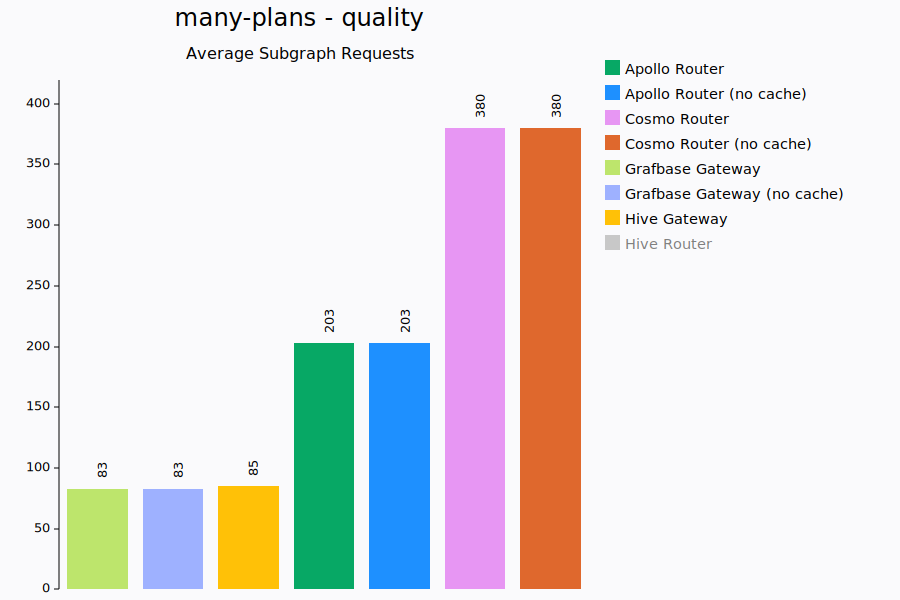

# System Information

Date: 2025-09-05
CPU: AMD Ryzen 9 7950X3D 16-Core Processor
Memory: 93.4 GiB
CPU Boost: Disabled
Git Commit: 26ec185d2b2a66c1e14fab97e7126b83e800b561
Linux Version: 6.16.1
Docker Version: 28.3.3
# many-plans

We use 7 subgraphs with very similar schemas and execute a fairly large and deep query retrieving all possible fields.
This forces the gateway query planner to consider many different possible plans as each individual field can be resolved by multiple
subgraphs and every object is an entity that allows for entity joins.

The goal being to measure how efficient query planning is, this scenario is only relevant for gateways that have caching disabled.
We only really care about the query planning performance and how many subgraph requests end up being executed. The subgraph requests
themselves are so small and simple that they shouldn't have any significant impact.

Query Planning performance is important during the re-deployment of gateways where many plans need to be re-computed.

K6 runs with a single VU.

## Latencies (ms)

| Gateway                     |     Min |     Med |     P90 |     P95 |     P99 |     Max |
| :-------------------------- | ------: | ------: | ------: | ------: | ------: | ------: |
| Apollo Router               |     8.2 |     9.3 |    10.3 |    10.7 |    12.0 |  3398.1 |
| Apollo Router (with dedup)  |     err |     err |     err |     err |     err |     err |
| Apollo Router (no cache)    |  3352.1 |  3354.3 |  3408.3 |  3415.1 |  3420.5 |  3421.8 |
| Cosmo Router                |    15.3 |    18.0 |    19.5 |    19.8 |    20.9 |   390.6 |
| Cosmo Router (no cache)     |   364.1 |   376.0 |   381.0 |   381.8 |   383.2 |   383.6 |
| Grafbase Gateway            |     1.7 |     2.1 |     2.3 |     2.4 |     2.7 |    27.0 |
| Grafbase Gateway (no cache) |    18.6 |    19.7 |    20.9 |    21.6 |    23.0 |    26.3 |
| Hive Gateway                |     err |     err |     err |     err |     err |     err |
| Hive Gateway (no cache?)    |     err |     err |     err |     err |     err |     err |
| Hive Router                 |    >13s |    >13s |    >13s |    >13s |    >13s |    >13s |

## Resources

| Gateway                     |          CPU |  CPU max |         Memory |   MEM max |  requests/core.s |  requests/GB.s |
| :-------------------------- | -----------: | -------: | -------------: | --------: | ---------------: | -------------: |
| Apollo Router               |    152% ±33% |     174% |   496 ±119 MiB |   802 MiB |             39.8 |           88.5 |
| Apollo Router (with dedup)  |    145% ±29% |     165% |   490 ±121 MiB |   802 MiB |              err |            err |
| Apollo Router (no cache)    |      99% ±1% |     101% |   776 ±268 MiB |  1252 MiB |              0.3 |            0.2 |
| Cosmo Router                |     503% ±4% |     509% |      71 ±1 MiB |    74 MiB |             10.4 |          735.7 |
| Cosmo Router (no cache)     |     160% ±8% |     173% |      73 ±5 MiB |    79 MiB |              1.5 |           34.4 |
| Grafbase Gateway            |     168% ±1% |     169% |      45 ±2 MiB |    48 MiB |            274.3 |         9845.5 |
| Grafbase Gateway (no cache) |     108% ±0% |     108% |     100 ±3 MiB |   104 MiB |             46.5 |          492.5 |
| Hive Gateway                |     109% ±5% |     120% |    476 ±83 MiB |   537 MiB |              err |            err |
| Hive Gateway (no cache?)    |     110% ±5% |     122% |    477 ±83 MiB |   539 MiB |              err |            err |
| Hive Router                 |     100% ±0% |     100% |     138 ±0 MiB |   139 MiB |              0.0 |            0.0 |

## Requests

| Gateway                     | Requests | Failures | Subgraph requests (total) |
| :-------------------------- | -------: | -------: | ------------------------: |
| Apollo Router               |      694 |        0 |              203 (140882) |
| Apollo Router (with dedup)  |      768 |        5 |               108 (82717) |
| Apollo Router (no cache)    |        3 |        0 |                 203 (609) |
| Cosmo Router                |      531 |        0 |              192 (102019) |
| Cosmo Router (no cache)     |       27 |        0 |                187 (5049) |
| Grafbase Gateway            |     4635 |        0 |             77.8 (360393) |
| Grafbase Gateway (no cache) |      502 |        0 |              77.7 (39008) |
| Hive Gateway                |      679 |      679 |               6.00 (4074) |
| Hive Gateway (no cache?)    |      680 |      680 |               6.00 (4080) |
| Hive Router                 |        0 |        0 |                     0 (0) |

