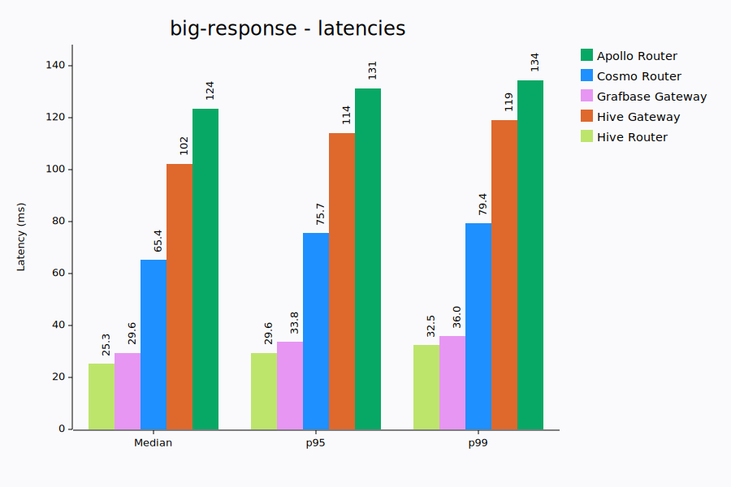
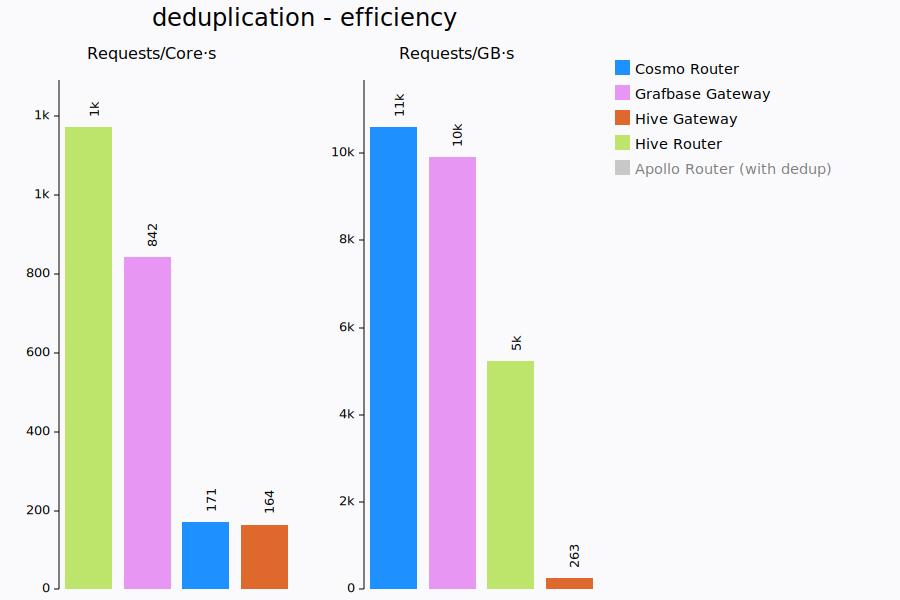
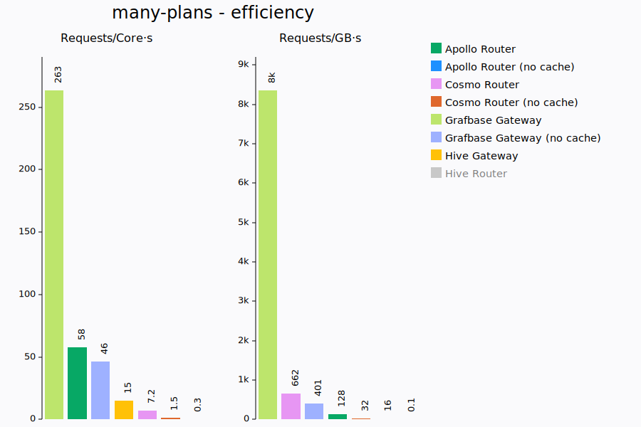
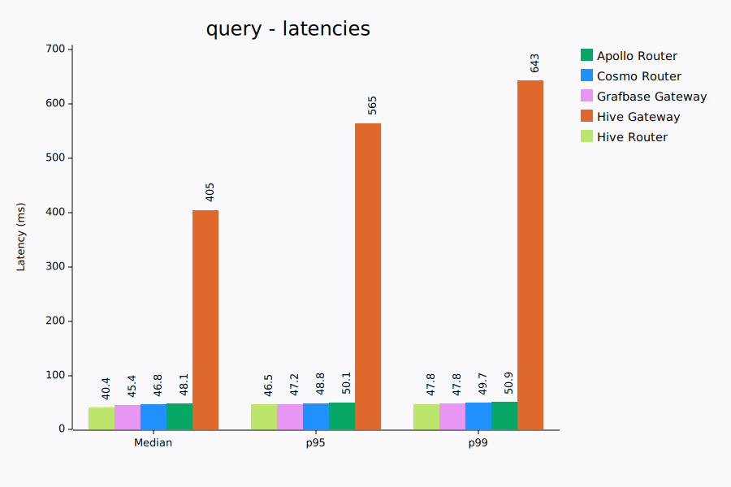

# System Information

Date: 2025-09-05
CPU: AMD Ryzen 9 7950X3D 16-Core Processor
Memory: 93.4 GiB
CPU Boost: Disabled
Git Commit: 48fa708c3f07457414c098e4796cdd092bdc82c3
Linux Version: 6.16.1
Docker Version: 28.3.3

# Benchmarks

## big-response

Tests gateway performance with large GraphQL response payloads (~8MiB) containing a mix of lists, objects strings, floats and ints.

K6 runs with a single VU, executing requests sequentially, to measure the best case latencies a gateway could provide.

### Requests

| Gateway          | Requests | Failures | Subgraph requests (total) |
| :--------------- | -------: | -------: | ------------------------: |
| Apollo Router    |       79 |        0 |                 1.00 (79) |
| Cosmo Router     |      136 |        0 |                1.00 (136) |
| Grafbase Gateway |      295 |        0 |                1.00 (295) |
| Hive Gateway     |       58 |        0 |                 1.00 (58) |
| Hive Router      |     1227 |     1227 |               1.00 (1227) |

### Latencies (ms)

| Gateway          |     Min |     Med |     P90 |     P95 |     P99 |     Max |
| :--------------- | ------: | ------: | ------: | ------: | ------: | ------: |
| Apollo Router    |   116.9 |   123.5 |   128.7 |   132.0 |   162.6 |   241.3 |
| Cosmo Router     |    51.3 |    71.2 |    80.6 |    82.0 |    85.5 |   180.5 |
| Grafbase Gateway |    27.2 |    31.2 |    34.4 |    35.2 |    36.6 |   139.6 |
| Hive Gateway     |   158.9 |   164.9 |   178.8 |   186.4 |   290.0 |   405.5 |
| Hive Router      |   <err> |   <err> |   <err> |   <err> |   <err> |   <err> |

### Resources

| Gateway          |          CPU |  CPU max |         Memory |   MEM max |  requests/core.s |  requests/GB.s |
| :--------------- | -----------: | -------: | -------------: | --------: | ---------------: | -------------: |
| Apollo Router    |      96% ±0% |      97% |    414 ±35 MiB |   469 MiB |              8.1 |           17.1 |
| Cosmo Router     |    217% ±12% |     246% |     102 ±9 MiB |   114 MiB |              5.5 |          121.2 |
| Grafbase Gateway |      88% ±1% |      89% |      70 ±5 MiB |    77 MiB |             33.0 |          391.6 |
| Hive Gateway     |     117% ±3% |     123% |    503 ±30 MiB |   530 MiB |              4.7 |           11.0 |
| Hive Router      |      91% ±0% |      91% |     157 ±1 MiB |   158 MiB |            <err> |          <err> |

## deduplication

Fairly complex query requiring a dozen subgraph requests with some duplicate plans/requests. The goal here is to measure how well the gateways
behaves under a certain throughput.

K6 runs with a constant throughput of 1000 requests/s

### Requests

| Gateway          | Requests | Failures | Subgraph requests (total) |
| :--------------- | -------: | -------: | ------------------------: |
| Apollo Router    |    10000 |        0 |            16.00 (160000) |
| Cosmo Router     |    10000 |        0 |               0.63 (6277) |
| Grafbase Gateway |    10001 |        0 |               0.89 (8859) |
| Hive Gateway     |     1436 |        0 |              7.01 (10071) |
| Hive Router      |    10000 |        0 |               0.65 (6451) |

### Latencies (ms)

| Gateway          |     Min |     Med |     P90 |     P95 |     P99 |     Max |
| :--------------- | ------: | ------: | ------: | ------: | ------: | ------: |
| Apollo Router    |    46.0 |    48.6 |    50.0 |    50.7 |    53.1 |    89.5 |
| Cosmo Router     |    16.0 |    43.9 |    50.6 |    52.0 |    54.4 |    70.4 |
| Grafbase Gateway |    14.5 |    41.4 |    46.0 |    46.9 |    48.3 |    65.1 |
| Hive Gateway     |   160.5 |   680.5 |  2644.9 | 10710.5 | 10972.5 | 11028.6 |
| Hive Router      |    17.3 |    40.1 |    45.6 |    46.4 |    47.6 |    50.9 |

### Resources

| Gateway          |          CPU |  CPU max |         Memory |   MEM max |  requests/core.s |  requests/GB.s |
| :--------------- | -----------: | -------: | -------------: | --------: | ---------------: | -------------: |
| Apollo Router    |     663% ±3% |     667% |     310 ±9 MiB |   323 MiB |            149.1 |         3154.9 |
| Cosmo Router     |     584% ±4% |     591% |      83 ±5 MiB |    90 MiB |            168.6 |        11287.1 |
| Grafbase Gateway |     112% ±3% |     116% |      97 ±4 MiB |   102 MiB |            858.0 |         9958.6 |
| Hive Gateway     |     128% ±6% |     141% |    583 ±64 MiB |   619 MiB |             89.5 |          208.7 |
| Hive Router      |      82% ±2% |      85% |     183 ±4 MiB |   189 MiB |           1169.9 |         5387.5 |

## long-lived-big-response

A very similar paylaod to big-response (~8MiB) is used, but now we add an extra subgraph request that takes 100ms. This forces the
gateway to keep the response for longer in memory and gives us a more realistic idea of how much cpu and memory a gateway would need.

K6 runs with 10 VUs to put some pressure on the gateways.

### Requests

| Gateway          | Requests | Failures | Subgraph requests (total) |
| :--------------- | -------: | -------: | ------------------------: |
| Apollo Router    |      319 |        0 |                2.00 (638) |
| Cosmo Router     |      479 |        0 |                2.00 (958) |
| Grafbase Gateway |      605 |        0 |               2.00 (1210) |
| Hive Gateway     |       65 |        0 |                2.00 (130) |
| Hive Router      |    10019 |    10019 |               0.11 (1148) |

### Latencies (ms)

| Gateway          |     Min |     Med |     P90 |     P95 |     P99 |     Max |
| :--------------- | ------: | ------: | ------: | ------: | ------: | ------: |
| Apollo Router    |   220.8 |   303.7 |   368.3 |   408.5 |   562.2 |   563.7 |
| Cosmo Router     |   151.9 |   205.9 |   233.2 |   244.9 |   369.7 |   374.6 |
| Grafbase Gateway |   131.6 |   161.5 |   180.7 |   190.4 |   266.4 |   274.0 |
| Hive Gateway     |   340.3 |  1638.1 |  2781.3 |  3080.6 |  3317.4 |  3408.1 |
| Hive Router      |   <err> |   <err> |   <err> |   <err> |   <err> |   <err> |

### Resources

| Gateway          |          CPU |  CPU max |         Memory |   MEM max |  requests/core.s |  requests/GB.s |
| :--------------- | -----------: | -------: | -------------: | --------: | ---------------: | -------------: |
| Apollo Router    |    467% ±22% |     495% |  2053 ±260 MiB |  2370 MiB |              6.3 |           13.4 |
| Cosmo Router     |    876% ±76% |     978% |    840 ±54 MiB |   911 MiB |              4.8 |           53.2 |
| Grafbase Gateway |     226% ±7% |     239% |    340 ±32 MiB |   377 MiB |             25.1 |          162.7 |
| Hive Gateway     |     120% ±6% |     131% |    668 ±33 MiB |   733 MiB |              4.3 |            7.8 |
| Hive Router      |     731% ±6% |     737% |     346 ±0 MiB |   346 MiB |            <err> |          <err> |

## many-plans

We use 7 subgraphs with very similar schemas and execute a fairly large and deep query retrieving all possible fields.
This forces the gateway query planner to consider many different possible plans as each individual field can be resolved by multiple
subgraphs and every object is an entity that allows for entity joins.

The goal being to measure how efficient query planning is, this scenario is only relevant for gateways that have caching disabled.
We only really care about the query planning performance and how many subgraph requests end up being executed. The subgraph requests
themselves are so small and simple that they shouldn't have any significant impact.

Query Planning performance is important during the re-deployment of gateways where many plans need to be re-computed.

K6 runs with a single VU.

### Requests

| Gateway                     | Requests | Failures | Subgraph requests (total) |
| :-------------------------- | -------: | -------: | ------------------------: |
| Apollo Router               |      572 |        0 |           203.00 (116116) |
| Apollo Router (no cache)    |        3 |        0 |              203.00 (609) |
| Cosmo Router                |      535 |        0 |           193.32 (103426) |
| Cosmo Router (no cache)     |       27 |        0 |             190.00 (5130) |
| Grafbase Gateway            |     4678 |        0 |            77.68 (363383) |
| Grafbase Gateway (no cache) |      507 |        0 |             77.70 (39396) |
| Hive Gateway                |      675 |      675 |               6.00 (4050) |
| Hive Router                 |        0 |        0 |                     0 (0) |

### Latencies (ms)

| Gateway                     |     Min |     Med |     P90 |     P95 |     P99 |     Max |
| :-------------------------- | ------: | ------: | ------: | ------: | ------: | ------: |
| Apollo Router               |     8.1 |    11.1 |    12.6 |    13.4 |    14.8 |  3540.6 |
| Apollo Router (no cache)    |  3347.9 |  3363.3 |  3430.4 |  3438.8 |  3445.5 |  3447.2 |
| Cosmo Router                |    15.4 |    17.9 |    19.3 |    19.6 |    20.2 |   383.3 |
| Cosmo Router (no cache)     |   364.8 |   372.9 |   381.3 |   381.7 |   383.5 |   384.0 |
| Grafbase Gateway            |     1.7 |     2.1 |     2.3 |     2.4 |     2.6 |    28.3 |
| Grafbase Gateway (no cache) |    18.5 |    19.5 |    20.3 |    20.9 |    23.0 |    27.3 |
| Hive Gateway                |   <err> |   <err> |   <err> |   <err> |   <err> |   <err> |
| Hive Router                 |    >13s |    >13s |    >13s |    >13s |    >13s |    >13s |

### Resources

| Gateway                     |          CPU |  CPU max |         Memory |   MEM max |  requests/core.s |  requests/GB.s |
| :-------------------------- | -----------: | -------: | -------------: | --------: | ---------------: | -------------: |
| Apollo Router               |    148% ±33% |     172% |   494 ±111 MiB |   781 MiB |             33.3 |           74.9 |
| Apollo Router (no cache)    |      99% ±2% |     101% |   764 ±259 MiB |  1203 MiB |              0.3 |            0.3 |
| Cosmo Router                |     500% ±5% |     509% |      71 ±2 MiB |    75 MiB |             10.5 |          733.3 |
| Cosmo Router (no cache)     |     160% ±5% |     166% |      71 ±6 MiB |    78 MiB |              1.6 |           35.3 |
| Grafbase Gateway            |     167% ±1% |     168% |      50 ±2 MiB |    52 MiB |            278.8 |         9211.2 |
| Grafbase Gateway (no cache) |     108% ±0% |     108% |     105 ±6 MiB |   113 MiB |             46.8 |          458.9 |
| Hive Gateway                |     110% ±5% |     121% |    479 ±86 MiB |   542 MiB |            <err> |          <err> |
| Hive Router                 |     100% ±0% |     100% |     139 ±0 MiB |   139 MiB |              0.0 |            0.0 |

## query

Fairly complex query requiring a dozen subgraph requests with some duplicate plans/requests. The goal here is to measure how well the gateways
behaves under a certain throughput.

K6 runs with a constant throughput of 100 requests/s

### Requests

| Gateway          | Requests | Failures | Subgraph requests (total) |
| :--------------- | -------: | -------: | ------------------------: |
| Apollo Router    |     1001 |        0 |             16.00 (16016) |
| Cosmo Router     |     1000 |        0 |               8.01 (8012) |
| Grafbase Gateway |     1000 |        0 |             13.00 (13000) |
| Hive Gateway     |      994 |        0 |               7.00 (6962) |
| Hive Router      |     1000 |        0 |               4.03 (4029) |

### Latencies (ms)

| Gateway          |     Min |     Med |     P90 |     P95 |     P99 |     Max |
| :--------------- | ------: | ------: | ------: | ------: | ------: | ------: |
| Apollo Router    |    45.4 |    48.1 |    49.6 |    50.0 |    50.7 |    54.1 |
| Cosmo Router     |    44.1 |    46.8 |    48.1 |    48.5 |    49.1 |    50.5 |
| Grafbase Gateway |    43.5 |    45.5 |    46.6 |    46.9 |    47.7 |    49.3 |
| Hive Gateway     |    38.6 |    43.0 |   102.0 |   131.6 |   167.0 |   186.6 |
| Hive Router      |    33.6 |    43.9 |    46.5 |    47.0 |    47.8 |    48.7 |

### Resources

| Gateway          |          CPU |  CPU max |         Memory |   MEM max |  requests/core.s |  requests/GB.s |
| :--------------- | -----------: | -------: | -------------: | --------: | ---------------: | -------------: |
| Apollo Router    |      46% ±1% |      48% |      67 ±3 MiB |    72 MiB |            205.9 |         1423.3 |
| Cosmo Router     |      59% ±2% |      61% |      43 ±1 MiB |    44 MiB |            163.6 |         2306.4 |
| Grafbase Gateway |      13% ±1% |      15% |      30 ±1 MiB |    31 MiB |            677.6 |         3311.6 |
| Hive Gateway     |     98% ±15% |     131% |    519 ±62 MiB |   577 MiB |             75.7 |          175.6 |
| Hive Router      |      10% ±0% |      11% |     155 ±2 MiB |   157 MiB |            913.7 |          648.4 |

