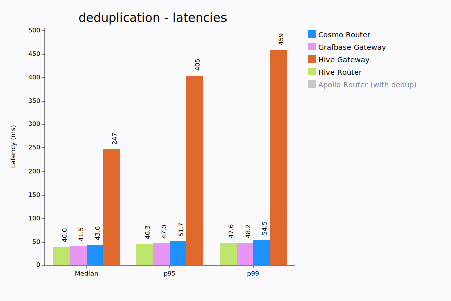
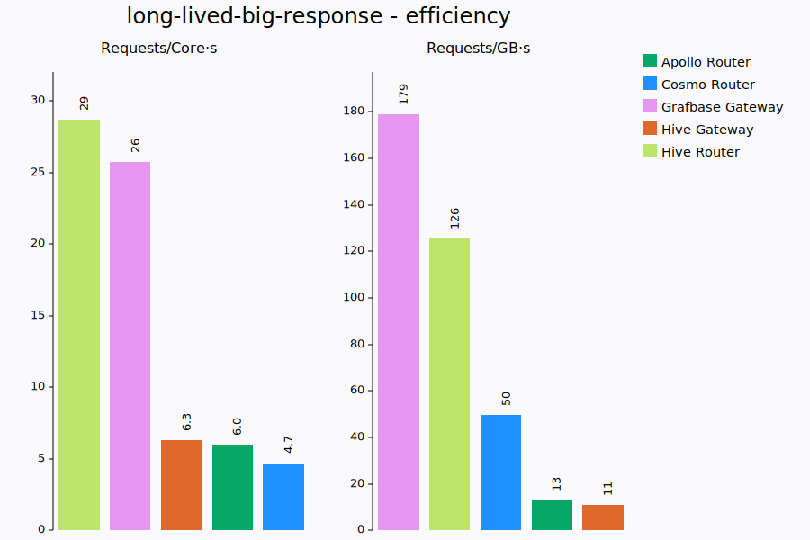
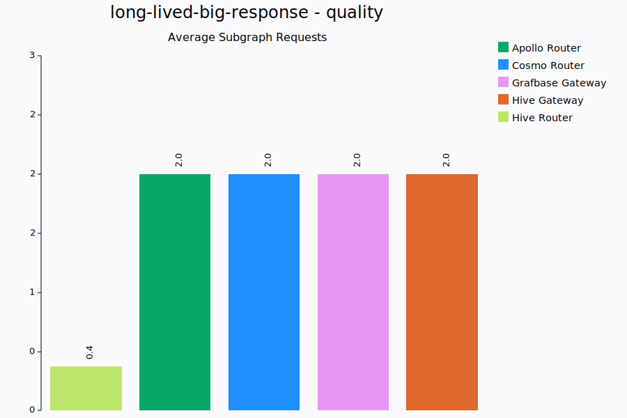
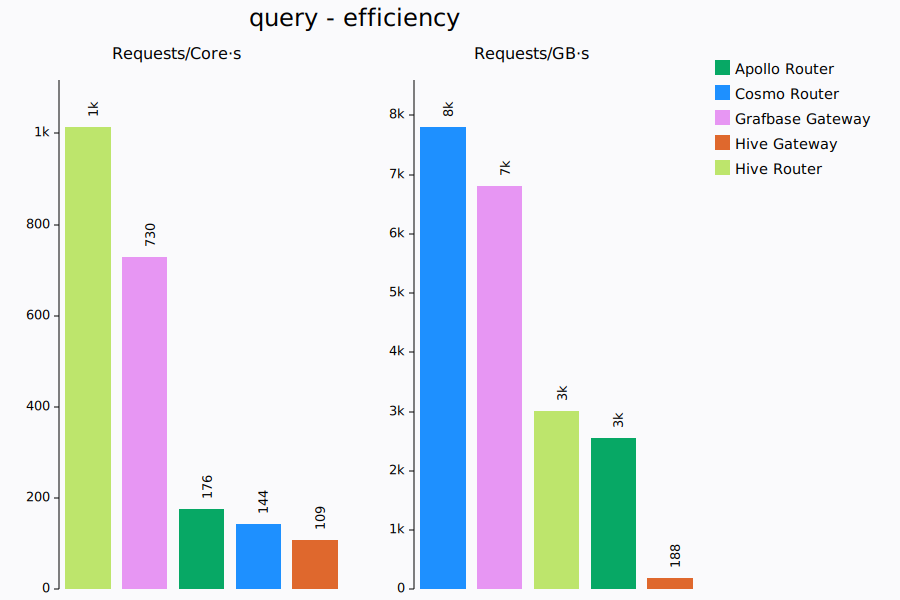

# System Information

- Date: 2025-09-22
- CPU: AMD Ryzen 9 7950X3D 16-Core Processor
- Memory: 93.4 GiB
- CPU Boost: Disabled
- Git Commit: d12ddc8e72138f7448e2033f65ab0ed2d2b250da
- Linux Version: 6.16.1
- Docker Version: 28.3.3

# Gateways

The following gateways were tested (as configured in `config.toml`):

- apollo-router: ghcr.io/apollographql/router:v2.6.0
- apollo-router-dedup: ghcr.io/apollographql/router:v2.6.0
- apollo-router-no-cache: apollo-router-no-cache
- cosmo: ghcr.io/wundergraph/cosmo/router:0.252.1
- cosmo-no-cache: ghcr.io/wundergraph/cosmo/router:0.252.1
- grafbase: ghcr.io/grafbase/gateway:0.49.1
- grafbase-no-cache: ghcr.io/grafbase/gateway:0.49.1
- hive-gateway: ghcr.io/graphql-hive/gateway:2.1.6
- hive-router: ghcr.io/graphql-hive/router:0.0.9

# big-response

Tests gateway performance with large GraphQL response payloads (~8MiB) containing a mix of lists, objects strings, floats and ints.

K6 runs with a single VU, executing requests sequentially, to measure the best case latencies a gateway could provide.

## Latencies (ms)

| Gateway          |   Min |   Med |   P90 |   P95 |   P99 |   Max |
| :--------------- | ----: | ----: | ----: | ----: | ----: | ----: |
| Hive Router      |  21.1 |  25.3 |  28.5 |  29.6 |  32.5 | 126.9 |
| Grafbase Gateway |  25.4 |  29.6 |  32.6 |  33.8 |  36.0 | 130.1 |
| Cosmo Router     |  46.0 |  65.4 |  73.9 |  75.7 |  79.4 | 172.3 |
| Hive Gateway     |  97.3 | 102.4 | 113.0 | 114.2 | 119.2 | 337.3 |
| Apollo Router    | 113.6 | 123.5 | 129.5 | 131.4 | 134.5 | 230.0 |

## Resources

| Gateway          |   CPU avg | CPU max |     MEM avg | MEM max | requests/core.s | requests/GB.s |
| :--------------- | --------: | ------: | ----------: | ------: | --------------: | ------------: |
| Hive Router      |   79% ±1% |     81% |  191 ±4 MiB | 196 MiB |            44.1 |         187.4 |
| Grafbase Gateway |   86% ±1% |     89% |   71 ±7 MiB |  89 MiB |            34.9 |         359.3 |
| Apollo Router    |   96% ±0% |     97% | 459 ±70 MiB | 614 MiB |             8.2 |          13.2 |
| Hive Gateway     |  119% ±2% |    123% | 901 ±21 MiB | 952 MiB |             7.6 |          10.0 |
| Cosmo Router     | 252% ±19% |    306% | 148 ±17 MiB | 184 MiB |             4.8 |          82.7 |

## Requests

| Gateway          | Requests | Failures | Subgraph requests (total) |
| :--------------- | -------: | -------: | ------------------------: |
| Apollo Router    |      476 |        0 |                1.00 (476) |
| Cosmo Router     |      890 |        0 |                1.00 (890) |
| Grafbase Gateway |     1867 |        0 |               1.00 (1867) |
| Hive Gateway     |      561 |        0 |                1.00 (561) |
| Hive Router      |     2152 |        0 |               1.00 (2152) |

# deduplication

Fairly complex query requiring a dozen subgraph requests with some duplicate plans/requests. The goal here is to measure how well the gateways
behaves under a certain throughput.

K6 runs with a constant throughput of 1000 requests/s

## Latencies (ms)

| Gateway                    |    Min |    Med |    P90 |    P95 |    P99 |    Max |
| :------------------------- | -----: | -----: | -----: | -----: | -----: | -----: |
| Hive Router                |   13.2 |   40.0 |   45.5 |   46.3 |   47.6 |   51.2 |
| Grafbase Gateway           |   13.4 |   41.5 |   46.1 |   47.0 |   48.2 |   68.5 |
| Cosmo Router               |   15.9 |   43.6 |   50.2 |   51.7 |   54.5 |   84.3 |
| Hive Gateway               |   76.5 |  247.1 |  370.7 |  404.6 |  459.1 | 1414.0 |
| Apollo Router (with dedup) | errors | errors | errors | errors | errors | errors |

## Resources

| Gateway                    |   CPU avg | CPU max |       MEM avg |  MEM max | requests/core.s | requests/GB.s |
| :------------------------- | --------: | ------: | ------------: | -------: | --------------: | ------------: |
| Hive Router                |   80% ±2% |     85% |    187 ±4 MiB |  195 MiB |          1172.9 |        5242.7 |
| Grafbase Gateway           |  113% ±3% |    119% |     99 ±2 MiB |  103 MiB |           842.3 |        9907.6 |
| Cosmo Router               |  576% ±5% |    585% |     86 ±5 MiB |   96 MiB |           170.8 |       10605.4 |
| Hive Gateway               |  391% ±9% |    424% | 2535 ±264 MiB | 2720 MiB |           164.5 |         262.6 |
| Apollo Router (with dedup) | 977% ±15% |   1010% |    200 ±5 MiB |  220 MiB |          errors |        errors |

## Requests

| Gateway                    | Requests | Failures | Subgraph requests (total) |
| :------------------------- | -------: | -------: | ------------------------: |
| Hive Gateway               |    42092 |        0 |              0.29 (12186) |
| Cosmo Router               |    60001 |        0 |              0.63 (37680) |
| Hive Router                |    60001 |        0 |              0.64 (38655) |
| Grafbase Gateway           |    60001 |        0 |              0.90 (54019) |
| Apollo Router (with dedup) |    60001 |       36 |              1.24 (74287) |

# long-lived-big-response

A very similar paylaod to big-response (~8MiB) is used, but now we add an extra subgraph request that takes 100ms. This forces the
gateway to keep the response for longer in memory and gives us a more realistic idea of how much cpu and memory a gateway would need.

K6 runs with 10 VUs to put some pressure on the gateways.

## Latencies (ms)

| Gateway          |   Min |   Med |   P90 |   P95 |   P99 |   Max |
| :--------------- | ----: | ----: | ----: | ----: | ----: | ----: |
| Hive Router\*    | 104.7 | 140.7 | 154.5 | 158.6 | 166.5 | 269.3 |
| Grafbase Gateway | 127.8 | 159.9 | 177.4 | 182.8 | 195.5 | 269.6 |
| Cosmo Router     | 144.1 | 208.7 | 235.5 | 242.7 | 255.7 | 368.6 |
| Apollo Router    | 217.8 | 303.0 | 362.0 | 376.8 | 448.1 | 529.3 |
| Hive Gateway     | 216.9 | 402.7 | 562.8 | 598.8 | 763.0 | 793.8 |

\*Hive router doesn't respect the authorization header and deduplicates requests. So the `hive-router` results are effectively not comparable.

## Resources

| Gateway          |    CPU avg | CPU max |       MEM avg |  MEM max | requests/core.s | requests/GB.s |
| :--------------- | ---------: | ------: | ------------: | -------: | --------------: | ------------: |
| Hive Router\*    |   227% ±6% |    242% |   533 ±18 MiB |  567 MiB |            28.7 |         125.6 |
| Grafbase Gateway |   218% ±6% |    238% |   320 ±19 MiB |  350 MiB |            25.8 |         179.0 |
| Hive Gateway     |   346% ±6% |    364% |  1959 ±97 MiB | 2104 MiB |             6.3 |          11.1 |
| Apollo Router    |  458% ±28% |    539% | 2248 ±162 MiB | 2555 MiB |             6.0 |          12.9 |
| Cosmo Router     | 801% ±108% |   1009% |   824 ±64 MiB |  976 MiB |             4.7 |          49.8 |

\*Hive router doesn't respect the authorization header and deduplicates requests. So the `hive-router` results are effectively not comparable.

## Requests

| Gateway          | Requests | Failures | Subgraph requests (total) |
| :--------------- | -------: | -------: | ------------------------: |
| Hive Router\*    |     4183 |        0 |               0.37 (1563) |
| Apollo Router    |     1940 |        0 |               2.00 (3880) |
| Cosmo Router     |     2854 |        0 |               2.00 (5708) |
| Grafbase Gateway |     3681 |        0 |               2.00 (7362) |
| Hive Gateway     |     1384 |        0 |               2.00 (2768) |

\*Hive router doesn't respect the authorization header and deduplicates requests. So the `hive-router` results are effectively not comparable.

# many-plans

We use 7 subgraphs with very similar schemas and execute a fairly large and deep query retrieving all possible fields.
This forces the gateway query planner to consider many different possible plans as each individual field can be resolved by multiple
subgraphs and every object is an entity that allows for entity joins.

The goal being to measure how efficient query planning is, this scenario is only relevant for gateways that have caching disabled.
We only really care about the query planning performance and how many subgraph requests end up being executed. The subgraph requests
themselves are so small and simple that they shouldn't have any significant impact.

Query Planning performance is important during the re-deployment of gateways where many plans need to be re-computed.

K6 runs with a single VU.

## Latencies (ms)

| Gateway                     |    Min |    Med |    P90 |    P95 |    P99 |    Max |
| :-------------------------- | -----: | -----: | -----: | -----: | -----: | -----: |
| Grafbase Gateway            |    1.7 |    2.0 |    2.2 |    2.3 |    2.5 |   27.5 |
| Apollo Router               |    7.9 |    9.2 |    9.9 |   10.1 |   11.0 | 3376.9 |
| Cosmo Router                |   14.9 |   17.7 |   19.1 |   19.4 |   20.3 |  383.0 |
| Grafbase Gateway (no cache) |   18.4 |   19.5 |   20.1 |   20.4 |   21.3 |   26.5 |
| Hive Gateway                |   28.1 |   29.2 |   31.6 |   32.6 |   47.1 |  250.3 |
| Cosmo Router (no cache)     |  341.7 |  353.5 |  358.3 |  359.4 |  362.9 |  367.6 |
| Apollo Router (no cache)    | 3294.5 | 3322.2 | 3349.8 | 3368.8 | 3399.7 | 3407.5 |
| Hive Router                 | errors | errors | errors | errors | errors | errors |

## Resources

| Gateway                     |   CPU avg | CPU max |        MEM avg |  MEM max | requests/core.s | requests/GB.s |
| :-------------------------- | --------: | ------: | -------------: | -------: | --------------: | ------------: |
| Grafbase Gateway            |  168% ±1% |    169% |      53 ±2 MiB |   57 MiB |           282.9 |        8619.3 |
| Apollo Router               | 170% ±15% |    175% |    485 ±43 MiB |  803 MiB |            57.6 |         129.0 |
| Grafbase Gateway (no cache) |  108% ±0% |    108% |     105 ±5 MiB |  113 MiB |            47.1 |         460.3 |
| Hive Gateway                |  111% ±6% |    145% |  1276 ±159 MiB | 1396 MiB |            22.7 |          24.2 |
| Cosmo Router                |  509% ±6% |    522% |      73 ±2 MiB |   80 MiB |            10.7 |         716.3 |
| Cosmo Router (no cache)     |  161% ±5% |    173% |      78 ±4 MiB |   85 MiB |             1.6 |          34.2 |
| Apollo Router (no cache)    |  100% ±1% |    101% | 2281 ±1001 MiB | 4061 MiB |             0.3 |           0.1 |
| Hive Router                 |  100% ±0% |    100% |     143 ±3 MiB |  149 MiB |          errors |        errors |

## Requests

| Gateway                     | Requests | Failures | Subgraph requests (total) |
| :-------------------------- | -------: | -------: | ------------------------: |
| Hive Gateway                |     1978 |        0 |              39.6 (78276) |
| Grafbase Gateway            |    28713 |        0 |            77.7 (2230523) |
| Grafbase Gateway (no cache) |     3057 |        0 |             77.8 (237830) |
| Cosmo Router                |     3351 |        0 |              193 (645203) |
| Cosmo Router (no cache)     |      170 |        0 |               193 (32861) |
| Apollo Router               |     6069 |        0 |             203 (1232007) |
| Apollo Router (no cache)    |       18 |        0 |                203 (3654) |
| Hive Router                 |        1 |        2 |                  0.00 (0) |

# query

Fairly complex query requiring a dozen subgraph requests with some duplicate plans/requests. The goal here is to measure how well the gateways
behaves under a certain throughput.

K6 runs with a constant throughput of 500 requests/s

## Latencies (ms)

| Gateway          |  Min |   Med |   P90 |   P95 |   P99 |    Max |
| :--------------- | ---: | ----: | ----: | ----: | ----: | -----: |
| Hive Router\*    | 17.4 |  40.4 |  45.7 |  46.5 |  47.8 |   50.0 |
| Grafbase Gateway | 43.4 |  45.4 |  46.7 |  47.2 |  47.8 |   61.6 |
| Cosmo Router     | 43.9 |  46.8 |  48.4 |  48.8 |  49.7 |   66.4 |
| Apollo Router    | 45.1 |  48.1 |  49.6 |  50.1 |  50.9 |   73.6 |
| Hive Gateway     | 86.1 | 404.8 | 517.8 | 564.5 | 642.8 | 1470.6 |

\*Hive router doesn't respect the authorization header and deduplicates requests. So the `hive-router` results are effectively not comparable.

## Resources

| Gateway          |   CPU avg | CPU max |       MEM avg |  MEM max | requests/core.s | requests/GB.s |
| :--------------- | --------: | ------: | ------------: | -------: | --------------: | ------------: |
| Hive Router\*    |   45% ±2% |     49% |    162 ±4 MiB |  170 MiB |          1014.2 |        3003.6 |
| Grafbase Gateway |   62% ±2% |     68% |     71 ±2 MiB |   75 MiB |           729.7 |        6798.0 |
| Apollo Router    |  269% ±5% |    284% |    191 ±5 MiB |  200 MiB |           176.0 |        2556.3 |
| Cosmo Router     |  336% ±4% |    346% |     62 ±2 MiB |   66 MiB |           144.2 |        7805.4 |
| Hive Gateway     | 377% ±10% |    410% | 2220 ±172 MiB | 2428 MiB |           108.8 |         188.1 |

\*Hive router doesn't respect the authorization header and deduplicates requests. So the `hive-router` results are effectively not comparable.

## Requests

| Gateway          | Requests | Failures | Subgraph requests (total) |
| :--------------- | -------: | -------: | ------------------------: |
| Hive Router v    |    29983 |        0 |              1.28 (38341) |
| Hive Gateway     |    26926 |        0 |             7.00 (188578) |
| Cosmo Router     |    29984 |        0 |             8.01 (240189) |
| Grafbase Gateway |    29986 |        0 |             13.0 (389818) |
| Apollo Router    |    29984 |        0 |             16.0 (479744) |

\*Hive router doesn't respect the authorization header and deduplicates requests. So the `hive-router` results are effectively not comparable.
